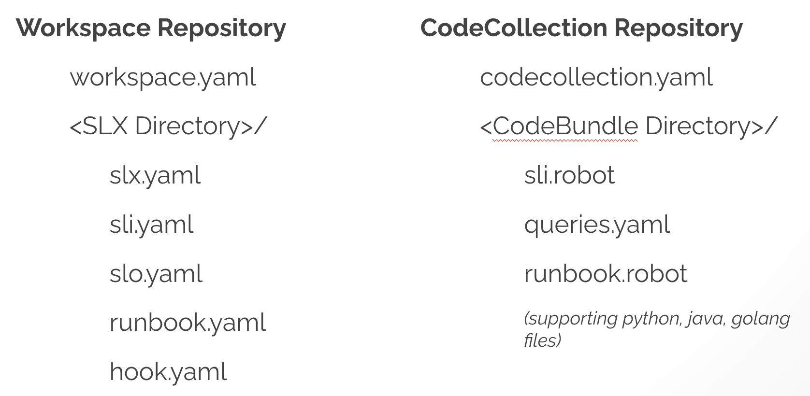

# Examples
This directory contains examples of workspaces and codecollections for the RunWhen platform to illustrate the layout of key elements in the object model.

## A Workspace vs a CodeCollection
A Workspace on the RunWhen platform is a git repository that holds configuration, and is nearly always private.  A CodeCollection on the other hand is a git repository that holds source code, and is very often public.  The strong separation of private configuration and public source code as a first class citizen on the RunWhen platform is one of the cornerstones of the object model that makes it possible for SREs to share code between individuals, teams and organizations.

As you go in to the readme's in each directory, you'll see that a Workspace is made up of SLXs, and a CodeCollection is made up of CodeBundles.  Speaking from our experience using our own product, about 80% of our Workspace SLXs rely on CodeBundles in (soon-to-be) public CodeCollections.  Only 20% of them are so specific to our environment that they are not worth contributing to open source repositories.  (These look almost like test code.)

## Repository Layout
This repository layout is somewhat artificial for tutorial simplicity.  In practice, each Workspace and each CodeCollection subdirectory you see here would be in their own repository.  While the most common case is one private Workspace repository per 2-5 person team, a secondary case is to have a Workspace that is in a directory in some other repository that is used by that team (e.g. in a subdirectory of an infra repo).

For further details on each, see the readme's in each directory. 
